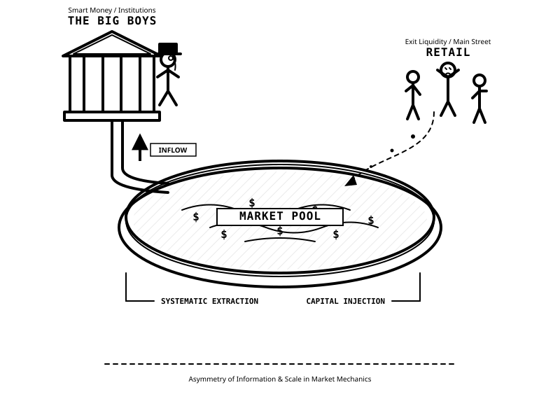

# Economy

Economy is an educational research project designed to simulate real-world financial markets. Its purpose is to model the mathematical dynamics and market participants that drive stocks and indices.
